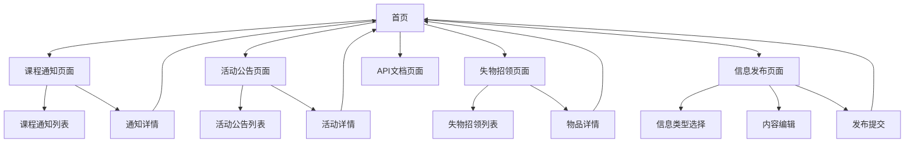

## 1. 产品概述

基于Python的校园综合服务信息聚合平台，为师生提供课程通知、活动公告、失物招领等校园信息的统一查询和发布入口。通过RESTful API接口实现信息聚合，解决校园信息分散、获取不便的问题，为后续移动端或小程序开发奠定基础。

## 2. 核心功能

### 2.1 用户角色

| 角色    | 注册方法      | 核心权限                     |
| ----- | --------- | ------------------------ |
| 普通用户  | 无需注册，直接访问 | 浏览和查询所有公开信息              |
| 信息发布者 | 管理员授权     | 发布、编辑、删除课程通知、活动公告、失物招领信息 |
| 系统管理员 | 预设账号      | 用户管理、权限分配、系统配置           |

### 2.2 功能模块

校园信息聚合平台需求包含以下主要页面：

1. **首页**：信息分类导航、最新信息列表、搜索功能
2. **课程通知页面**：课程通知列表、通知详情、筛选功能
3. **活动公告页面**：活动公告列表、活动详情、报名功能
4. **失物招领页面**：失物招领列表、物品详情、联系功能
5. **信息发布页面**：信息类型选择、内容编辑、发布提交
6. **API文档页面**：接口列表、在线测试、使用说明

### 2.3 页面详情

| 页面名称    | 模块名称   | 功能描述                               |
| ------- | ------ | ---------------------------------- |
| 首页      | 信息分类导航 | 显示课程通知、活动公告、失物招领三个主要分类入口，支持快速跳转    |
| 首页      | 最新信息列表 | 展示所有类型的最新信息，按时间倒序排列，显示标题、摘要、发布时间   |
| 首页      | 搜索功能   | 支持按关键字搜索所有类型的信息，实时显示搜索结果           |
| 课程通知页面  | 课程通知列表 | 显示所有课程通知，支持按课程名称、教师、时间筛选           |
| 课程通知页面  | 通知详情   | 显示通知完整内容，包括课程名称、教师、时间、地点、重要程度      |
| 活动公告页面  | 活动公告列表 | 显示所有活动公告，支持按活动类型、时间、地点筛选           |
| 活动公告页面  | 活动详情   | 显示活动完整信息，包括活动名称、时间、地点、参与方式、报名状态    |
| 失物招领页面  | 失物招领列表 | 显示所有失物招领信息，支持按物品类型、时间、地点筛选         |
| 失物招领页面  | 物品详情   | 显示物品详细信息，包括物品名称、特征、拾取/丢失时间、地点、联系方式 |
| 信息发布页面  | 信息类型选择 | 选择要发布的信息类型（课程通知/活动公告/失物招领）         |
| 信息发布页面  | 内容编辑   | 根据信息类型显示相应的表单字段，支持文本输入、时间选择、地点选择   |
| 信息发布页面  | 发布提交   | 验证表单数据，提交信息到后端API，显示发布结果           |
| API文档页面 | 接口列表   | 显示所有可用的API接口，包括接口路径、请求方法、参数说明      |
| API文档页面 | 在线测试   | 提供Swagger UI界面，支持在线测试API接口         |
| API文档页面 | 使用说明   | 提供API使用示例和最佳实践说明                   |

## 3. 核心流程

### 3.1 普通用户流程

1. 用户访问首页，浏览最新信息或使用搜索功能查找特定信息
2. 用户点击信息分类导航，进入对应的信息列表页面
3. 用户使用筛选功能缩小信息范围，查看感兴趣的信息
4. 用户点击信息标题，进入详情页面查看完整内容
5. 用户在失物招领页面可以查看联系方式，联系失主或拾取者

### 3.2 信息发布者流程

1. 信息发布者登录系统（如需要）
2. 进入信息发布页面，选择要发布的信息类型
3. 填写相应的表单信息，包括标题、内容、时间、地点等
4. 提交信息，系统验证数据完整性
5. 信息发布成功，返回首页或继续发布其他信息

### 3.3 页面导航流程

## 4. 用户界面设计

### 4.1 设计风格

* **主色调**：蓝色系（#2563EB）作为主色，体现学术和科技感

* **辅助色**：灰色系（#6B7280）用于次要信息，绿色（#10B981）用于成功状态，红色（#EF4444）用于重要通知

* **按钮风格**：圆角按钮，悬停时有轻微阴影效果

* **字体**：使用系统默认无衬线字体，标题字号18-24px，正文字号14-16px

* **布局风格**：卡片式布局，顶部导航栏，响应式设计

* **图标风格**：使用简洁的线性图标，保持视觉一致性

### 4.2 页面设计概述

| 页面名称    | 模块名称   | UI元素                                    |
| ------- | ------ | --------------------------------------- |
| 首页      | 信息分类导航 | 顶部固定导航栏，三个分类卡片使用蓝色背景，白色图标和文字，悬停时背景加深    |
| 首页      | 最新信息列表 | 卡片式布局，每个信息卡片包含标题、摘要、发布时间、分类标签，使用浅灰色背景分隔 |
| 首页      | 搜索功能   | 顶部搜索框，圆角设计，带搜索图标，支持实时搜索提示               |
| 课程通知页面  | 课程通知列表 | 左侧筛选栏，右侧信息列表，筛选栏包含课程名称、教师、时间范围选择器       |
| 课程通知页面  | 通知详情   | 大标题显示课程名称，重要程度用不同颜色标签标识，内容区域使用白色背景卡片    |
| 活动公告页面  | 活动公告列表 | 类似课程通知页面布局，增加活动类型筛选（学术讲座、文体活动、社团活动等）    |
| 活动公告页面  | 活动详情   | 活动时间地点用醒目图标显示，报名按钮使用绿色背景，已报名状态显示为灰色     |
| 失物招领页面  | 失物招领列表 | 物品类型用图标区分（失物用红色图标，招领用绿色图标），卡片显示物品图片缩略图  |
| 失物招领页面  | 物品详情   | 大图展示物品，特征描述用列表形式，联系方式用按钮形式显示            |
| 信息发布页面  | 信息类型选择 | 三个大卡片选择信息类型，选中状态用蓝色边框和背景标识              |
| 信息发布页面  | 内容编辑   | 表单布局，必填字段用红色星号标识，日期时间选择器使用日历控件          |
| 信息发布页面  | 发布提交   | 底部固定按钮栏，左侧取消按钮，右侧发布按钮，发布按钮带加载状态         |
| API文档页面 | 接口列表   | 左侧导航树显示接口分类，右侧显示接口详情，使用代码块展示请求示例        |
| API文档页面 | 在线测试   | 集成Swagger UI，保持默认样式，支持展开/折叠参数面板         |
| API文档页面 | 使用说明   | 使用Markdown格式，代码示例使用语法高亮，重要提示用黄色背景框      |

### 4.3 响应式设计

* **桌面优先**：优先设计桌面端体验，确保在1920x1080分辨率下显示良好

* **移动端适配**：使用响应式布局，在移动设备上自动调整为单列布局

* **触摸优化**：按钮和可点击元素最小尺寸为44x44px，确保触摸操作友好

* **断点设置**：768px以下为移动端，768px-1024px为平板端，1024px以上为桌面端

## 5. 非功能性需求

### 5.1 性能需求

* **响应时间**：API接口响应时间不超过500ms（95%的请求）

* **并发能力**：支持至少100个并发用户同时访问

* **数据加载**：页面首次加载时间不超过2秒

* **搜索性能**：关键字搜索响应时间不超过300ms

### 5.2 安全需求

* **数据验证**：所有用户输入必须进行严格验证，防止SQL注入和XSS攻击

* **权限控制**：信息发布和删除操作需要身份验证和权限检查

* **敏感信息**：联系方式等敏感信息在详情页面才显示，列表页面隐藏

* **API安全**：使用HTTPS协议，API密钥认证（如需要）

### 5.3 可扩展性需求

* **模块化设计**：系统采用模块化架构，便于添加新的信息类型

* **API规范**：遵循RESTful API设计规范，接口命名统一

* **数据库设计**：使用逻辑外键，便于后续扩展和迁移

* **文档完善**：API文档自动生成，便于第三方集成

### 5.4 可维护性需求

* **代码规范**：遵循Python PEP 8代码规范

* **注释完整**：关键函数和复杂逻辑添加详细注释

* **日志记录**：记录关键操作和错误信息，便于问题排查

* **测试覆盖**：核心功能单元测试覆盖率不低于80%

## 6. 数据需求

### 6.1 数据实体

* **课程通知**：包含通知ID、课程名称、教师姓名、通知内容、发布时间、重要程度、创建者

* **活动公告**：包含公告ID、活动名称、活动类型、活动时间、活动地点、活动内容、报名方式、创建者

* **失物招领**：包含信息ID、物品名称、物品类型、物品描述、拾取/丢失时间、地点、联系方式、信息类型（失物/招领）、创建者

* **用户**：包含用户ID、用户名、邮箱、角色、创建时间

### 6.2 数据格式

* **数据交互**：使用JSON格式进行数据交换

* **时间格式**：使用ISO 8601标准格式（YYYY-MM-DDTHH:mm:ss）

* **分页参数**：使用page和page\_size参数，默认page\_size为20

* **排序规则**：默认按创建时间倒序排列

### 6.3 数据验证

* **必填字段**：标题、内容、创建时间为必填字段

* **字段长度**：标题不超过200字符，内容不超过5000字符

* **时间范围**：活动时间不能早于当前时间

* **联系方式**：手机号格式验证，邮箱格式验证

### 6.4 数据存储

* **数据库选择**：使用SQLite或PostgreSQL存储结构化数据

* **文件存储**：物品图片等文件存储在本地文件系统或对象存储

* **缓存策略**：热门信息使用内存缓存，缓存时间30分钟

* **数据备份**：定期备份数据库，保留最近7天的备份文件

